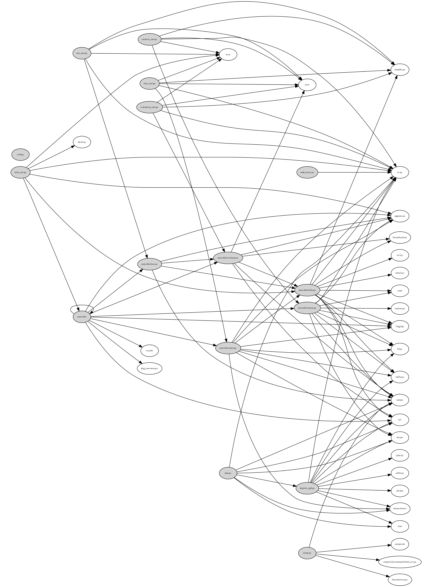

Develpment
==========

.. note:: You can skip this if you don't want to develop ``nntoolkit``. This
page explains how to contribute to ``nntoolkit``, the next pages explain how to
use ``nntoolkit``.

Project Structure
-----------------
The project is structured in several modules:

* *bin/nntoolkit*: The Python scripts which handles user interaction at the
  highest level. All subcommands have an own module, but at first the user
  input gets handled here.
* *nntoolkit/utils.py*: Utility functions that can be used in multiple scripts.
* *nntoolkit/create.py*: Create a neural network model file.
* *nntoolkit/train.py*: Train a neural network.
* *nntoolkit/evaluate.py*: Evaluate a neural network.
* *nntoolkit/test.py*: Test a neural network.

You can also print a dependency graph with the Python package ``snakefood``:

.. code:: bash

    $ sfood | sfood-graph  > dependencies.dot
    $ dot -Tpng dependencies.dot -s200 -o dependency-graph.png

which generates

You might have to set

.. code:: text

    graph G { 
        graph [ dpi = 300 ]; 
        /* The rest of your graph here. */ 
    }

TODOs
-----
See issues on GitHub: github.com/MartinThoma/nntoolkit

Current State
-------------

* lines of code without tests: LOC (``make countc``)
* lines of test code: LOT (``make countt``)
* test coverage: cov (``make test``)
* pylint score: lint (``pylint nntoolkit``)
* cheesecake_index: (``make testall``)
* users: How many people do currently actively use / develop ``nntoolkit``?

::

    date,        LOC,  LOT, cov, lint, cheesecake_index, users, changes
    2015-01-29, 1061,   86, 56%, 9.21,          362/595,     2, minor
    2015-01-29, 1139,   86, 56%, 9.22,          408/595,     2, minor (and fixed pylint for cheesecake_index)
    2015-01-31, 1333,  181, 56%, 9.26,          408/595,     2, minor (removed star-argument)

Pylint messages
---------------

Most (not all!) of the following pylint issues need to be fixed. What does
not need any attention is

* "Redefining built-in 'open'" when it is ``from future.builtins import open``

::

    $ pylint nntoolkit
    ************* Module nntoolkit.evaluate
    W: 13, 4: Redefining built-in 'open' (redefined-builtin)
    ************* Module nntoolkit.test
    W: 46, 4: Attempting to unpack a non-sequence defined at line 142 of nntoolkit.utils (unpacking-non-sequence)
    W: 46, 4: Attempting to unpack a non-sequence defined at line 146 of nntoolkit.utils (unpacking-non-sequence)
    W: 46, 4: Attempting to unpack a non-sequence defined at line 152 of nntoolkit.utils (unpacking-non-sequence)
    ************* Module nntoolkit.create
    W: 61, 0: TODO: the activation function could be here! (fixme)
    W: 75, 0: TODO: parse architecture string to allow arbitrary activation (fixme)
    R: 39, 0: Too many local variables (26/15) (too-many-locals)
    W: 72,21: Unused variable 'j' (unused-variable)
    ************* Module nntoolkit.train
    W:102, 0: TODO: Sigmoid - make dependant from activation function (fixme)
    W:130, 0: TODO: Eventually we miss training examples! (fixme)
    R: 61, 0: Too many arguments (6/5) (too-many-arguments)
    R: 61, 0: Too many local variables (30/15) (too-many-locals)
    E:103, 8: Assigning to function call which doesn't return (assignment-from-no-return)
    R:138, 0: Too many arguments (6/5) (too-many-arguments)
    W:149, 4: Attempting to unpack a non-sequence defined at line 142 of nntoolkit.utils (unpacking-non-sequence)
    W:149, 4: Attempting to unpack a non-sequence defined at line 146 of nntoolkit.utils (unpacking-non-sequence)
    W:149, 4: Attempting to unpack a non-sequence defined at line 152 of nntoolkit.utils (unpacking-non-sequence)
    ************* Module nntoolkit.utils
    W: 22, 4: Redefining built-in 'open' (redefined-builtin)
    R: 68, 0: Too many local variables (17/15) (too-many-locals)
    W:121, 9: Used * or ** magic (star-args)
    R:169, 0: Too many local variables (17/15) (too-many-locals)
    R:  1, 0: Similar lines in 2 files
    ==nntoolkit.evaluate:15
    ==nntoolkit.train:13
    import nntoolkit.utils as utils

    def get_parser():
        """Return the parser object for this script."""
        from argparse import ArgumentParser, ArgumentDefaultsHelpFormatter
        parser = ArgumentParser(description=__doc__,
                                formatter_class=ArgumentDefaultsHelpFormatter)
        parser.add_argument("-m", "--model", (duplicate-code)
    R:  1, 0: Similar lines in 2 files
    ==nntoolkit.test:13
    ==nntoolkit.train:16
    def get_parser():
        """Return the parser object for this script."""
        from argparse import ArgumentParser, ArgumentDefaultsHelpFormatter
        parser = ArgumentParser(description=__doc__,
                                formatter_class=ArgumentDefaultsHelpFormatter)
        parser.add_argument("-m", "--model",
                            dest="model_file",
                            help="where is the model file (.tar) which should get " (duplicate-code)
    R:  1, 0: Similar lines in 2 files
    ==nntoolkit.evaluate:18
    ==nntoolkit.test:13
    def get_parser():
        """Return the parser object for this script."""
        from argparse import ArgumentParser, ArgumentDefaultsHelpFormatter
        parser = ArgumentParser(description=__doc__,
                                formatter_class=ArgumentDefaultsHelpFormatter)
        parser.add_argument("-m", "--model", (duplicate-code)

    Report
    ======
    376 statements analysed.

    Statistics by type
    ------------------

    +---------+-------+-----------+-----------+------------+---------+
    |type     |number |old number |difference |%documented |%badname |
    +=========+=======+===========+===========+============+=========+
    |module   |6      |6          |=          |100.00      |0.00     |
    +---------+-------+-----------+-----------+------------+---------+
    |class    |0      |0          |=          |0           |0        |
    +---------+-------+-----------+-----------+------------+---------+
    |method   |0      |0          |=          |0           |0        |
    +---------+-------+-----------+-----------+------------+---------+
    |function |20     |20         |=          |100.00      |0.00     |
    +---------+-------+-----------+-----------+------------+---------+

    External dependencies
    ---------------------
    ::

        future 
          \-builtins (nntoolkit.utils,nntoolkit.evaluate)
        h5py (nntoolkit.create,nntoolkit.utils)
        nntoolkit 
          \-evaluate (nntoolkit.test)
        numpy (nntoolkit.create,nntoolkit.utils,nntoolkit.train,nntoolkit.test,nntoolkit.evaluate)
        pkg_resources (nntoolkit)
        theano (nntoolkit.create,nntoolkit.train)
          \-tensor (nntoolkit.train)
        yaml (nntoolkit.create,nntoolkit.utils)

    Raw metrics
    -----------

    +----------+-------+------+---------+-----------+
    |type      |number |%     |previous |difference |
    +==========+=======+======+=========+===========+
    |code      |474    |69.71 |474      |=          |
    +----------+-------+------+---------+-----------+
    |docstring |103    |15.15 |103      |=          |
    +----------+-------+------+---------+-----------+
    |comment   |40     |5.88  |40       |=          |
    +----------+-------+------+---------+-----------+
    |empty     |63     |9.26  |63       |=          |
    +----------+-------+------+---------+-----------+

    Duplication
    -----------

    +-------------------------+------+---------+-----------+
    |                         |now   |previous |difference |
    +=========================+======+=========+===========+
    |nb duplicated lines      |23    |23       |=          |
    +-------------------------+------+---------+-----------+
    |percent duplicated lines |3.096 |3.096    |=          |
    +-------------------------+------+---------+-----------+

    Messages by category
    --------------------

    +-----------+-------+---------+-----------+
    |type       |number |previous |difference |
    +===========+=======+=========+===========+
    |convention |0      |0        |=          |
    +-----------+-------+---------+-----------+
    |refactor   |9      |9        |=          |
    +-----------+-------+---------+-----------+
    |warning    |14     |14       |=          |
    +-----------+-------+---------+-----------+
    |error      |1      |1        |=          |
    +-----------+-------+---------+-----------+

    % errors / warnings by module
    -----------------------------

    +-------------------+-------+--------+---------+-----------+
    |module             |error  |warning |refactor |convention |
    +===================+=======+========+=========+===========+
    |nntoolkit.train    |100.00 |35.71   |33.33    |0.00       |
    +-------------------+-------+--------+---------+-----------+
    |nntoolkit.create   |0.00   |21.43   |11.11    |0.00       |
    +-------------------+-------+--------+---------+-----------+
    |nntoolkit.test     |0.00   |21.43   |0.00     |0.00       |
    +-------------------+-------+--------+---------+-----------+
    |nntoolkit.utils    |0.00   |14.29   |55.56    |0.00       |
    +-------------------+-------+--------+---------+-----------+
    |nntoolkit.evaluate |0.00   |7.14    |0.00     |0.00       |
    +-------------------+-------+--------+---------+-----------+

    Messages
    --------

    +--------------------------+------------+
    |message id                |occurrences |
    +==========================+============+
    |unpacking-non-sequence    |6           |
    +--------------------------+------------+
    |too-many-locals           |4           |
    +--------------------------+------------+
    |fixme                     |4           |
    +--------------------------+------------+
    |duplicate-code            |3           |
    +--------------------------+------------+
    |too-many-arguments        |2           |
    +--------------------------+------------+
    |redefined-builtin         |2           |
    +--------------------------+------------+
    |unused-variable           |1           |
    +--------------------------+------------+
    |star-args                 |1           |
    +--------------------------+------------+
    |assignment-from-no-return |1           |
    +--------------------------+------------+

    Global evaluation
    -----------------
    Your code has been rated at 9.26/10 (previous run: 9.26/10, +0.00)

Feedback
--------
General feedback can be sent to info@martin-thoma.de